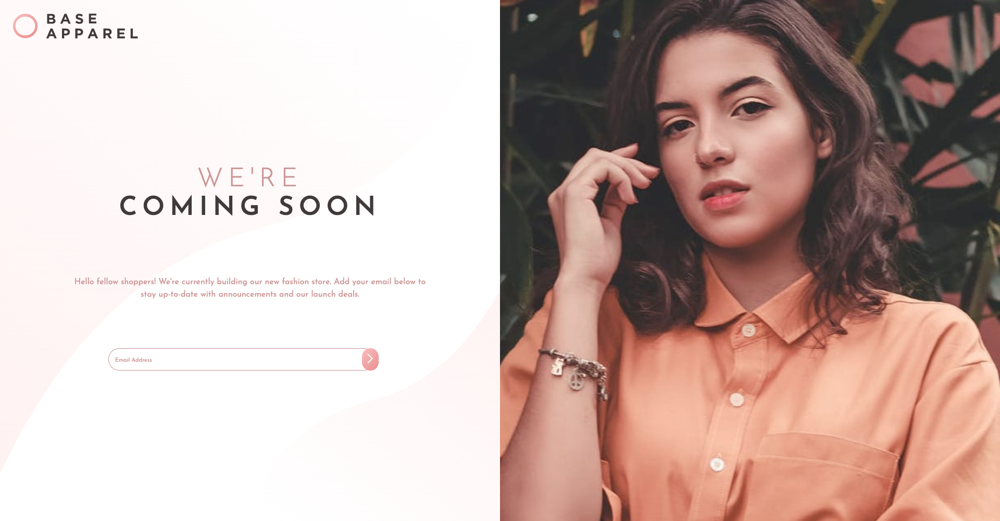

# Base Apparel

- This project is a challenge created by https://www.frontendmentor.io/dashboard
- Esse projeto é um desafio criado por https://www.frontendmentor.io/dashboard

Base Apparel was created to enhance my skills with HTML/CSS and Javascript and it only serves for portfolio.
Base Apparel foi criado para aprimorar minhas habilidades com HTML/CSS and Javascript e adicionar ao meu portfólio.

- The main challenge of this project is to create an attractive design and also make it responsive for both desktop and mobile. And with the help of Javascript, detect if a user has input an email or not.

- O principal desafio desse projeto é criar um design atraente e fazer com que seja responsivo tanto no desktop como em mobile. E com a ajuda do Javascript, detectar se o usuário inseriu um e-email ou não.

# Website's Design

- The images below are screenshots/as imagens abaixo são screenshots.

## Desktop

## Mobile

## Active JS

